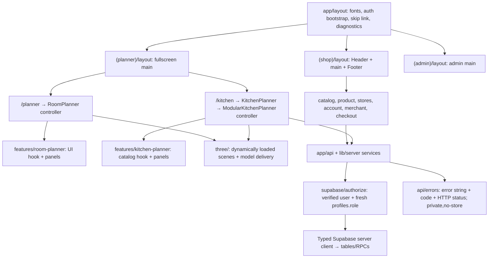

# Architecture

Updated: 2026-10-02 (Phase 4). This document describes the current implementation, not a future redesign.

## Route shells



Parenthesized route groups do not change URLs. Root layout contains no store chrome.
Neither planner route mounts the store Header/Footer. Admin has its own shell.
The shop's merchant workspace deliberately retains shop navigation.

## Feature dependency map

| Feature / routes | Controller, panel, service | API | Authoritative tables | Client store |
|---|---|---|---|---|
| Catalog / product | CatalogView, ProductCustomizer; catalogServer/catalogValidation | products, models | furniture_models | catalog (cache/derived view) |
| Store directory / home | storeDirectory; FeaturedMerchants | stores, stores/featured | merchant_stores | none |
| Account / login / register | account route; authFetch/authErrors | protected routes use requireUser | auth.users, profiles | auth |
| Room planner | components/RoomPlanner; features/room-planner/hooks and components | products, models, kitchens | furniture_models; kitchen_garnitures for imported kitchens | designs, catalog |
| Kitchen editor | KitchenPlanner/ModularKitchenPlanner; features/kitchen-planner; kitchenAssembly/Placement/Extras/Bom; editorHistory | kitchen-modules, products, kitchens, kitchens/[id]/thumbnail, kitchens/[id]/versions | kitchen_modules, kitchen_module_variants, material_definitions, kitchen_garnitures, kitchen_garniture_versions | kitchens; catalog; in-memory undo/redo |
| Kitchen marketplace | (shop)/kitchens routes; kitchenMarketplaceServer and validation | kitchen-designs, merchant/kitchen-designs/*, admin/kitchen-designs, kitchen-render-jobs/* | kitchen_designs, kitchen_design_versions, kitchen_design_media, kitchen_design_reviews, kitchen_render_jobs, kitchen_marketplace_audit, kitchen_render_policy | editor projects remain in kitchens |
| Kitchen quotation | kitchenQuotes validation; merchant/customer panels | kitchen-designs/[id]/quotes, kitchen-quotes, merchant/kitchen-quotes | kitchen_quote_requests | none |
| Merchant workspace | MerchantDashboard; merchantServer/Validation | merchant/store, products, orders, analytics, notifications | merchant_stores, furniture_models, merchant_order_fulfillments, user_notifications | auth |
| Admin | admin route; AdminProducts/KitchenModules/Merchants panels | admin/* | profiles and feature tables above | auth |
| Checkout / payment | orderService/orderValidation; payments/providers and settlement | orders/*, payments/* | orders, order_payments, merchant_order_fulfillments | cart (selection only) |
| Wishlist | wishlist route / product controls | products | furniture_models | wishlist (IDs only) |
| Contact | contact/siteContact | contact, admin/messages | contact_messages | none |
| GLB processing/export | modelAssets/r2Models/modelPrefetch; scripts/models worker | models/*, admin/models/*, kitchen/export/skp | furniture_models; configured R2/Supabase storage | catalog + decoded cache |

API names above are under /api. Feature business rules belong in lib/; route handlers
verify identity, validate input and call those services or transactional RPCs.
Scene code belongs in three/, not API handlers. Panels own presentation; hooks own
ephemeral UI or cancellable fetching. Existing large controller entry files stay in
components/ for compatibility; further panel extraction is incremental, not a
requirement that every legacy component be rewritten in one release.

## Single-source rules

- Product metadata, stock and price: furniture_models. catalog/modelRegistry are
  read caches and derived adapters, never competing editable catalogs.
- Store metadata: merchant_stores. Static stores.ts and runtime fallback removed.
  owner_id NULL denotes a platform directory store, not a merchant account.
  Existing IDs and furniture_models.store_ids are preserved by migration.
  Product membership is derived from store_ids; Store.productIds was removed.
- Furniture category IDs, names and images: lib/catalogCategories.ts. Category
  type, labels, navigation and validation derive from this manifest. SQL category
  enforcement is a generated migration snapshot tested against the manifest,
  not an independently edited catalog. A category change requires a new migration.
- Persisted room designs: store/designs per-user browser storage. Kitchen account
  projects: kitchen_garnitures via store/kitchens, immutable snapshots in kitchen_garniture_versions. New wizard drafts have isolated UUID-suffixed recovery keys. Local kitchen drafts are recovery
  data, not another public catalog.
- Immutable orders, published design versions, quotation snapshots and room
  imports intentionally retain historical copies. They must not be updated when
  a current product, store or saved kitchen changes.
- products_legacy_backup is an archival database table, not queried by app routes.
  It was not deleted as part of source-file cleanup.

## Types and API contract

database.types.ts is generated from the real public schema through Supabase MCP.
Both browser and server clients use createClient<Database>. database.ts overrides
only explicitly named RPC arguments that SQL accepts as NULL but the generator
represents as non-null. Domain objects are validated and serialized with toJson;
RPC JSON arrays/objects are narrowed at their boundary.

All API error responses preserve the existing UI-compatible string:
```json
{"error":"Нэвтрэх шаардлагатай.","code":"AUTH_REQUIRED"}
```

HTTP status remains the source of transport semantics. Errors use private,no-store
and preserve operational headers such as Retry-After. Successful responses retain
their feature-specific envelopes, including model status payloads whose error
field may legitimately be NULL.

requireUser, requireAdmin and requireMerchant delegate to one authorize helper.
All verify getUser(token); privileged roles come from a fresh profiles row.
They never authorize from user_metadata. RPCs independently recheck actors,
ownership and transactional state. Admin is not implicitly a merchant.
See [role permissions](role-permissions.md) and [data dictionary](data-dictionary.md).

## Migration, verification and cleanup

Migration: 20261001092640_architecture_store_directory.sql. Apply before deploying
the DB-only directory code. It seeds 13 existing platform stores without replacing
existing IDs, grants no accounts a role, and excludes platform stores from private
merchant fulfillment snapshots. Reapplying preserves admin edits.

Regression gates: architecture.test.cjs, store-directory.test.cjs, merchant-db.test.cjs,
merchant-api.test.cjs, existing planner/camera/GLB tests; then lint/typecheck/build
and browser checks across shop → planner → kitchen → shop.

Removed unused source: stores.ts, PartnerMarquee.tsx and the shadowed
kitchenMaterialTextures.tsx. The active texture pool is kitchenMaterialTextures.ts.
No historical database snapshots, GLBs, user accounts or orders are deleted.
See [verification record](phase1-verification.md) for checked scope and rollout status.

## Phase 2 asset pipeline

AdminKitchenModules / AdminProducts / ModelsTab → shared GlbUploadPreview → upload-url intent → R2 PUT → upload-complete inspection/checksum → queue_model_asset → Blender worker → immutable delivery/preview paths → module variant → ModularKitchenScene / GLBFurnitureMesh.

model_assets is the private version/role/state ledger. furniture_models carries current paths, archive state, canonical module binding and the latest validation; it remains the product master. Archive/restore is transactional, never a destructive file purge. See [GLB contract](glb-cabinet-standard.md).

## Phase 4 marketplace boundaries

The merchant's editable source lives in kitchen_garnitures. Marketplace versions
are immutable snapshots once submitted/reviewed; editing a source never changes
a published version. The explicit sync_project action replaces an editable draft
snapshot and invalidates derived thumbnails/AI media. Public readers see only
the approved published pointer of an active factory/handmade store, never review
notes, audit events, source project IDs or render jobs.

Canonical lifecycle: draft → submitted → changes_requested/approved → published.
An admin may suspend a published listing; owners/admins may archive listings. A newly drafted
version does not remove the previously approved public version. Historical
rejected values are displayed as changes_requested; SQL review actions retain
their historical representation while the domain/UI expose seven states.

Only an admin can approve, publish, resume or suspend. Merchant APIs and all
service-only mutation RPCs independently verify a fresh role, active eligible
store and ownership. Transactional guards lock the design before its versions
and render jobs; paid generation requires an explicit admin cost confirmation.
Internal snapshot helpers are in kitchen_internal, not exposed through PostgREST.

Customer clone → own editable project → save → quote creates an immutable
project_snapshot for the request. The owning merchant can inspect that snapshot
in a lazy-loaded, read-only 3D/2D/BOM dialog and respond. Notification links focus
the exact design/quote and cannot navigate to an external origin.

AI consent is recorded with the request; a rolling store-wide 24h allowance is
checked under an advisory lock. Failed/cancelled requests still count. Queued
requests may be cancelled, not already-processing jobs. No generation starts
without explicit approval; no paid request was made during Phase 4 verification.

See [Phase 4 verification](phase4-verification.md) for the verified live test flow
and remaining deployment/paid-render gates.
